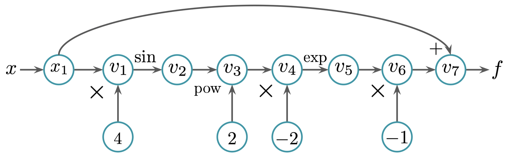

# Documentation
## Milestone 1
### Git Fighters

## 1 Introduction
This package is a project aiming to enable automatic differentiation with Python. Automatic differentiation is a technique to find the derivative of a function computationally. Differentiation is an important part of mathematical analysis, and differentiation is frequently used in machine learning, numerical analysis, or economic optimization applications. This package is developed on GitHub. 

## 2 Background
Enabling automatic differentiation involves the several mathematical concepts and techniques. 

### 2.1 Differentiation
The derivative of a function y = f(x) at the point $P = (x_1, f(x_1))$ is the slope of the tangent line at that point and can be written as:

$f’(x_1) = lim_{∆x \to 0} \frac{f(x_1 + ∆x) - f(x_1)}{∆x}$

Only if this limit exists, the function y = f(x) is differentiable at point $x_1$.

#### 2.1.1 Rules of Differentiation
Multiple rules apply to differentiation:

Rule 1: Derivative of a constant function

If f(x) = c, with c constant, then f’(x) = 0.

Rule 2: Derivative of a linear function

If f(x) = mx + b, with m and b constants, then f’(x) = m.

Rule 3: Derivative of a power function

If $f(x) = x^{n}$, then $f’(x) = nx^{n-1}$.

Rule 4: Derivative of the constant multiple of a function

If g(x) = cf(x), with c constant, then g’(x) = cf’(x).

Rule 5: Derivative of the sum or difference of a pair of functions

If h(x) = g(x) + f(x), then h’(x) = g’(x) + f’(x), while if h(x) = g(x) - f(x), then h’(x) = g’(x) - f’(x).

Rule 6: Derivative of the sum of an arbitrary but finite number of functions

If $h(x) = \sum_{i=1}^{n} g_i(x)$, then $h'(x) = \sum_{i=1}^{n} g’_i(x)$.

Rule 7: Derivative of the product of two functions

If h(x) = f(x)g(x), then h’(x) = f’(x)g(x) + f(x)g’(x).

Rule 8: Derivative of the quotient of two functions

If $h(x) = \frac{f(x)}{g(x)}$, g(x) ≠ 0, then $h’(x) = \frac{f’(x)g(x) - f(x)g’(x)}{[g(x)]^{2}}$.

Rule 9: Derivative of a function of a function (chain rule)

If y = f(u) and u = g(x) so that y = f(g(x)) = h(x), then h’(x) = f’(u)g’(x) or

$\frac{dy}{dx} = \frac{dy}{du}\frac{du}{dx}$.

Rule 10: Derivative of the inverse of a function

If y = f(x) has the inverse function x = g(x), that is, if $g(y) = f^{-1}(y)$ and f’(x) ≠ 0, then

$\frac{dx}{dy} = \frac{1}{dy/dx}$ or $g’(x) = \frac{1}{f’(x)}$ where y = f(x).

Rule 11: Derivative of an exponential function

If $y = e^{x}$, then $dy/dx = e^{x}$. 

Rule 12: Derivative of a logarithmic function

If y = ln(x), then dy/dx = 1/x.

#### 2.1.2 Partial Derivatives
Functions with more than one variable have more than one derivative. A function of n variables, $y = f(x_1, x_2,…,n_n)$, has n partial derivatives $f_1, f_2,…f_n$. The partial derivatives can be arranged in a column or row vector called the gradient ($\nabla_{x}$ denotes the gradient with respect to x). 

For scalar-valued functions the gradient and the Jacobian matrix are identical. For vector-valued functions, the Jacobian matrix is defined as:

$J_{ij} = \frac{\partial f_i}{\partial x_j}$ = $\left[\begin{array}{cc} \frac{\partial f_1}{\partial x_1} & \cdots & \frac{\partial f_1}{\partial x_n} \\ \cdots & \cdots & \cdots \\ \frac{\partial f_m}{\partial x_1} & \cdots & \frac{\partial f_m}{\partial x_n}
\end{array}\right]$.

The entries of the Jacobian matrix are all points in which a vector-valued function is differentiable.

### 2.2 Graph Structure
The graph structure visualizes the elementary operations performed to evaluate a function at a point (x). The point x is the input value, and f is the output value. The nodes ($v_i$) illustrate the sequence of operations necessary to compute the output value. Each node is labeled accordingly (like times 4 or pow 2). The example below is based on $f(x) = x - e^{-2sin^{4x}}$ and borrowed from lecture 10:


### 2.3 Elementary Functions
This package supports several elementary functions. The rules of differentiation list most elementary functions, such as quadratic, exponential, or logarithmic functions, but (inverse) trigonometric and hyperbolic functions are also supported. 

## 3 Software Organization

### 3.1 Directory Structure

The outline below presents the directory structure and the main modules we plan to implement in our package:

```
cs107-FinalProject/
    docs/  
        milestone1.md
        ...
    gitfighters/
        __init__.py
        git_fighters.py
        elementary_operations.py
    tests/
        __init__.py
        test_git_fighters.py
        test_elementary_operations.py
    demos/
        intro_ad.py
        multivariate_ad.py
        vector_valued_ad.py
        ...
    README.md
    requirements.txt
    .travis.yml
```

This is not an exhaustive representation of the directory structure we will implement, but it highlights the general implementation ideas.

### 3.2 Basic Modules Implementation and Their Functionality

- **git_fighters:** This module will contain our custom automatic differentiation library. The functionality for our 'Node' class will be embeded in this module. It will contain the values and the derivatives of the final function, as well as the values and derivatives at every point of the evaluation trace.
- **elementary_operations:** This module will contain our custom implementation of the elementary operations (sin(), cos(), matmul(), exp(), etc.). Each elementary operation will contain two main methods: value and gradient.

### 3.3 Test Suite

The test suite will live in a tests directory. There will be two main testing modules:

- **test_git_fighters:** This module will test the functionality of the git_fighters module.
- **test_elementary_operations:** This module will test the functionality of the elementary_operations module.

We plan to use the continous integration platform Travis CI, to automatically build and test code changes, and CodeCov to measure the coverage of lines executed by our test suite.

### 3.4 Package Distribution

We will use Python Package Index (PyPI) to build, upload and distribute our package. Python Package Index is an official third-party ecosystem for distribution of Python packages in the **sdist** format (Pure-Python packages) or in the **wheels** format (packages with Compiled Artifacts).

### 3.5 Software Packaging

We will not use a framework to package our software. The underlying reason is that the software does not fit in any of the conventional software packaging frameworks.

## 4 Implementation

The implementation will be mostly based on classes to carry out the auto differentiation via the methods defined by us, but we will also utilize data structures. Utilizing the existing data structures for storing the information is especially valuable for the cases where we need to keep track of multiple functions and calculate multiple outputs. The core data structures are lists, dictionaries and arrays for storing the traces, the derivatives and outputs during the step by step process of forward AD. E.g. to accommodate the vector inputs, we will use numpy arrays.

### 4.1. Classes
We plan to implement two classes:

1. Class 1 "Node" - class for creating a node. The main aim of this class is to store the values, the derivatives and the outputs for each input given the variable that the Node was made for. The easy access to all of this information will give us flexibility to extend the project in any of the directions we decide to explore later. The class methods that we are thinking to implement right now are

	- value - for the value of the function evaluated at the input
	- derivative - evaluated derivative at the given point. We are thinking of implementing this as a dictionary, so we can store the value and the derivative-evaluation pairs, and reuse it if needed later.

It is worthwhile to mention that the methods will take inputs as Nodes and will output Nodes. This will ensure that we can still perform various operations with our outputs. 
	

2. Class 2 &quot;Methods&quot; - class for overriding all the elementary mathematical functions. We discussed that it will be cleaner to have all the methods in one class. This class will include these major methods:

	- \_\_str\_\_
	- \_\_eq\_\_
	- \_\_repr\_\_
	- \_\_mul\_\_
	- \_\_rmul\_\_

	- \_\_add\_\_
	- \_\_radd\_\_
	- \_\_sin\_\_
	- \_\_cos\_\_
	- \_\_tan\_\_
	- \_\_pow\_\_
	- \_\_log\_\_
	- \_\_exp\_\_
	- \_\_trudiv\_\_
	- \_\_rtruediv\_\_

3. While we will create most of the classes, data structures and methods from scratch for our own use, we will still utilize some basic external libraries and dependencies such as:

    1. Travis Ci for tests
    2. Codecove for code coverage
    3. NumPy for mathematical operations and array data structures

### 4.2 Handling the elementary functions:

All the elementary functions will be overridden by us. Additionally, all the elementary functions will be able to take the input as Nodes and output Nodes. In our overridden function we will use self.value and self.derivative for evaluating the value and the derivative of the output Node.

```
def exp(Node):
	### calculate the value
	new_value = np.exp(node.point)
	
	### calculate the derivative
	new_derivative = np.exp(node.point) * node.derivative

	### update the trace table if we decide to implement it
	… (will skip for now)

	return Node(new_value, new_derivative)
```

## 5 Usage
We plan on making installation as easy as possible for the user. The package will be hosted on PyPi and installable via ```pip install gitfighters```

Alternatively, a user can git clone the repository, ```pip install requirements.txt```, and then be able to import the necessary files manually.

Once the modules are loaded, the user will be able to use the code as follows:

_Evaluating a function like $f(x) = 200 + x^3$ at point (-2):

```
from gitfighters import Node

# instantiate variables
a = Node(-2)
b = 200
v1 = a.exp(3)
v2 = a + v1
```
User can then access the function value and derivative value by:

```
print(v2.fnc_val, v2.drv_val)
>>> 192, 12
```

Alternatively, user can define a function, set a point and get the derivative value at that point by doing the following:
```
from gitfighters import drv_eval

def func(x):
	return 200 + x**3

b = -2

evaluation = drv_eval(func, (a,b))
print(evaluation)
>>> 192, 12
```

This will also be doable with vector inputs/outputs.


# Feedback 

## Milestone 1 feedback

### 1. Introduction
Feedback: - How does AD compare and improve from other similar methods?

Our response: Unlike some other techniques, automatic differentiation evaluates derivatives to machine precision, and it is less costly than symbolic differentiation. 

### 2. Background

Feedback: - Create your own graph structure.
Feedback: The flow could be enhanced by presenting an evaluation trace along with the computational graph.

Our response: Added own graph and table.

### 3. How to use

Feedback:  What is "a" in your second example?
Our response: 

Feedback: I did not see any information about drv_eval in your implementation. Would be good to get more info on that.
Ourresponse: 

### 4. Software Organization
Feedback: Why would the software not fit in any of the conventional software packaging frameworks? Explain further.
Answer: 


### 5. Implementation

Feedback: What does the output represent in your Node class? Add a short blurb on that in your Node class paragraph
Answer: The output is a Node itself. We will briefly introduce the Node output in our documentation.

Feedback: Do you need the whole trace table as a method in the Node class if you’re already defining the value and partial derivatives?
Answer: We have reconsidered our implementation and we will not include the trace table as a method. Since we are already storing the value and the partial derivative, the trace table will only be a space-inefficient addition.

Note. https://latex.codecogs.com/ is a helpful rendering service for showing equations on markdown.

We will make sure to render our equations.


