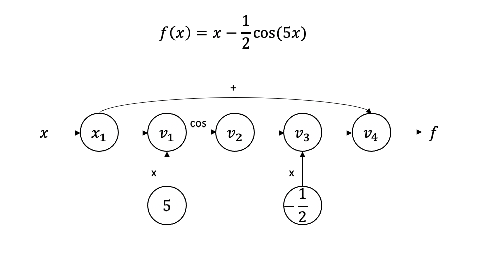
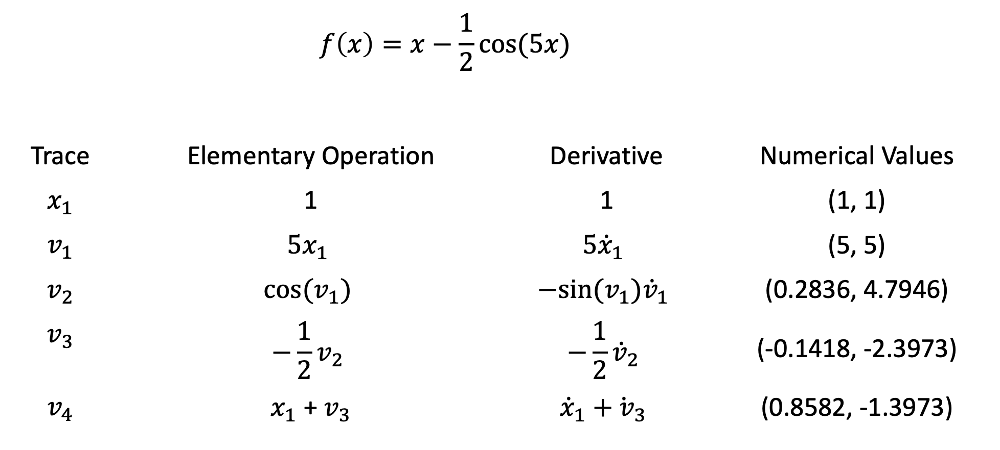

# Milestone 2
## Git Fighters

## 1 Introduction
This package is a project aiming to enable automatic differentiation with Python. Automatic differentiation is a technique to find the derivative of a function computationally. Unlike some other techniques, automatic differentiation evaluates derivatives to machine precision, and it is less costly than symbolic differentiation. Differentiation is an important part of mathematical analysis, and differentiation is frequently used in machine learning, numerical analysis, or economic optimization applications. This package is developed on GitHub. 

## 2 Background
Enabling automatic differentiation involves the several mathematical concepts and techniques. 

### 2.1 Differentiation
The derivative of a function y = f(x) at the point $P = (x_1, f(x_1))$ is the slope of the tangent line at that point and can be written as:

$f’(x_1) = lim_{∆x \to 0} \frac{f(x_1 + ∆x) - f(x_1)}{∆x}$

Only if this limit exists, the function y = f(x) is differentiable at point $x_1$.

#### 2.1.1 Rules of Differentiation
Multiple rules apply to differentiation:

Rule 1: Derivative of a constant function

If f(x) = c, with c constant, then f’(x) = 0.

Rule 2: Derivative of a linear function

If f(x) = mx + b, with m and b constants, then f’(x) = m.

Rule 3: Derivative of a power function

If $f(x) = x^{n}$, then $f’(x) = nx^{n-1}$.

Rule 4: Derivative of the constant multiple of a function

If g(x) = cf(x), with c constant, then g’(x) = cf’(x).

Rule 5: Derivative of the sum or difference of a pair of functions

If h(x) = g(x) + f(x), then h’(x) = g’(x) + f’(x), while if h(x) = g(x) - f(x), then h’(x) = g’(x) - f’(x).

Rule 6: Derivative of the sum of an arbitrary but finite number of functions

If $h(x) = \sum_{i=1}^{n} g_i(x)$, then $h'(x) = \sum_{i=1}^{n} g’_i(x)$.

Rule 7: Derivative of the product of two functions

If h(x) = f(x)g(x), then h’(x) = f’(x)g(x) + f(x)g’(x).

Rule 8: Derivative of the quotient of two functions

If $h(x) = \frac{f(x)}{g(x)}$, g(x) ≠ 0, then $h’(x) = \frac{f’(x)g(x) - f(x)g’(x)}{[g(x)]^{2}}$.

Rule 9: Derivative of a function of a function (chain rule)

If y = f(u) and u = g(x) so that y = f(g(x)) = h(x), then h’(x) = f’(u)g’(x) or

$\frac{dy}{dx} = \frac{dy}{du}\frac{du}{dx}$.

Rule 10: Derivative of the inverse of a function

If y = f(x) has the inverse function x = g(x), that is, if $g(y) = f^{-1}(y)$ and f’(x) ≠ 0, then

$\frac{dx}{dy} = \frac{1}{dy/dx}$ or $g’(x) = \frac{1}{f’(x)}$ where y = f(x).

Rule 11: Derivative of an exponential function

If $y = e^{x}$, then $dy/dx = e^{x}$. 

Rule 12: Derivative of a logarithmic function

If y = ln(x), then dy/dx = 1/x.

#### 2.1.2 Partial Derivatives
Functions with more than one variable have more than one derivative. A function of n variables, $y = f(x_1, x_2,…,n_n)$, has n partial derivatives $f_1, f_2,…f_n$. The partial derivatives can be arranged in a column or row vector called the gradient ($\nabla_{x}$ denotes the gradient with respect to x). 

For scalar-valued functions the gradient and the Jacobian matrix are identical. For vector-valued functions, the Jacobian matrix is defined as:

$J_{ij} = \frac{\partial f_i}{\partial x_j}$ = $\left[\begin{array}{cc} \frac{\partial f_1}{\partial x_1} & \cdots & \frac{\partial f_1}{\partial x_n} \\ \cdots & \cdots & \cdots \\ \frac{\partial f_m}{\partial x_1} & \cdots & \frac{\partial f_m}{\partial x_n}
\end{array}\right]$.

The entries of the Jacobian matrix are all points in which a vector-valued function is differentiable.

### 2.2 Graph Structure
The graph structure visualizes the elementary operations performed to evaluate a function at a point (x). The point x is the input value, and f is the output value. The nodes ($v_i$) illustrate the sequence of operations necessary to compute the output value. Each node is labeled accordingly (like times 5 or cos). The example below illustrates a graph:


The example below illustrates the corresponding evaluation table:


### 2.3 Elementary Functions
This package supports several elementary functions. The rules of differentiation list most elementary functions, such as quadratic, exponential, or logarithmic functions, but (inverse) trigonometric and hyperbolic functions are also supported. 

## 3 Software Organization

### 3.1 Directory Structure

The outline below presents the directory structure and the main modules we plan to implement in our package:

```
cs107-FinalProject/
    docs/  
        milestone1.md
        milestone2.md
        Evaluation_Graph.png
        Evaluation_Table.png
        ...
    gitfighters/
        test_suite.py
        git_fighters.py
        ...
    tests/
        ...
    demos/
        ...
    .travis.yml
    README.md
    requirements.txt
```

This is not an exhaustive representation of the directory structure we will implement, but it highlights the general implementation ideas.

### 3.2 Basic Modules Implementation and Their Functionality

- **git_fighters:** This module will contain our custom automatic differentiation library. Our 'fightingAD' class enables automatic differentiation with Python. It will contain the value and the derivative of the function. This module will also contain our custom implementation of the elementary operations (sin(), cos(), exp(), etc.).

### 3.3 Test Suite

The test suite will live in a tests directory. There will be one main testing module:

- **test_git_fighters:** This module will test the functionality of the git_fighters module.

We plan to use the continous integration platform Travis CI, to automatically build and test code changes, and CodeCov to measure the coverage of lines executed by our test suite.

### 3.4 Package Distribution

We will use Python Package Index (PyPI) to build, upload and distribute our package. Python Package Index is an official third-party ecosystem for distribution of Python packages in the **sdist** format (Pure-Python packages) or in the **wheels** format (packages with Compiled Artifacts).

### 3.5 Software Packaging

We will use **wheels**, a package format designed to ship libraries with compiled artifacts. The **wheels** package format is the most common tool for distributing reusable code, libraries between developers. Our implementation will not use a framework to distribute our software, since **frameworks** are primarily used for development and packaging of common python applications (web site backends, dynamic web frontends and mobile clients) targeting a non-developer audience.

## 4 Implementation

The implementation will be mostly based on classes to carry out the auto differentiation via the methods defined by us, but we will also utilize data structures. Utilizing the existing data structures for storing the information is especially valuable for the cases where we need to keep track of multiple functions and calculate multiple outputs. The core data structures are lists, dictionaries and arrays for storing the traces, the derivatives and outputs during the step by step process of forward AD. E.g. to accommodate the vector inputs, we will use numpy arrays.

### 4.1. Classes
We plan to implement one class:

The 'fightingAD' class aims to store and compute the value and the derivative of a given instance at a specific point. The easy access to all of these information will give us flexibility to extend the project in any of the directions we decide to explore later. The class has two variables with global scope:

	- val - the value of the function evaluated at a given point
	- der - the derivative at a given point

This class will include these major methods (incl. elementary mathematical functions):

	- \_\_str\_\_
	- \_\_repr\_\_
	- \_\_eq\_\_
	- \_\_ne\_\_
	- \_\_neg\_\_
	- \_\_pos\_\_
	- \_\_abs\_\_
	- \_\_mul\_\_
	- \_\_rmul\_\_
	- \_\_add\_\_
	- \_\_radd\_\_
	- \_\_sub\_\_
	- \_\_rsub\_\_
	- \_\_pow\_\_
	- \_\_rpow\_\_
	- \_\_trudiv\_\_
	- \_\_rtruediv\_\_
	- log
	- exp
	- sin
	- cos
	- tan
	- arcsin
	- arccos
	- arctan

It is worthwhile to mention that the methods can be performed on 'fightingAD' objects and on some other objects such as integers. This will ensure that we can perform various operations with our class.

3. While we will create most of the classes, data structures and methods from scratch for our own use, we will still utilize some basic external libraries and dependencies such as:

    1. Travis Ci for tests
    2. Codecove for code coverage
    3. NumPy for mathematical operations and array data structures

### 4.2 Handling the elementary functions:

All the elementary functions will be overridden by us. Additionally, all the elementary functions will be able to handle 'fightingAD' objects and some other objects. In our overridden functions we will use self.val and self.der for evaluating the value and the derivative of the returned object.

```
def __add__(self, other):
    try:
        return fightingAD(self.val + other.val, self.der + other.der)
    except AttributeError:
        try:
            return fightingAD(self.val + other, self.der)
        except:
            raise TypeError(
                "unsupported operand type(s) for +: {} and {}".format(
                    type(self).__name__, type(other).__name__
                )
            )
    else:
        raise Exception("unsupported operation for +")
	
```

## 5 Usage
We plan on making installation as easy as possible for the user. The package will be hosted on PyPi and installable via ```pip install gitfighters```

Alternatively, a user can git clone the repository, ```pip install requirements.txt```, and then be able to import the necessary files manually.

Once the modules are loaded, the user will be able to use the code as follows:

Evaluating a function like $f(x) = 200 + x^3$ at point x = (-2):

```
from git_fighters import *

# instantiate a new object
x = fightingAD(-2)

# perform elementary operations on it
f = 200 + x**3
```

User can then access the function value and derivative value by:

```
print(f.val, f.der)
>>> 192, 12
```

Alternatively, user can skip doing all the elementary operations manually and just call ```drv_eval(f, x)```, feeding it a mathematical function and a point (or vector) at which it should be evaluated like follows:
```
from gitfighters import drv_eval

def func(x):  # example mathematical function
	return 200 + x**3

x = -2  # point at which we want func() evaluated

evaluation = drv_eval(func, x)
print(evaluation)
>>> 192, 12
```

This will also be doable with vector inputs/outputs.
